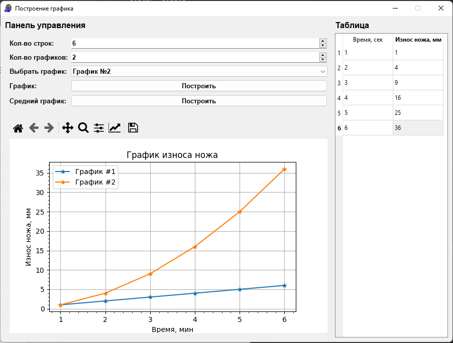
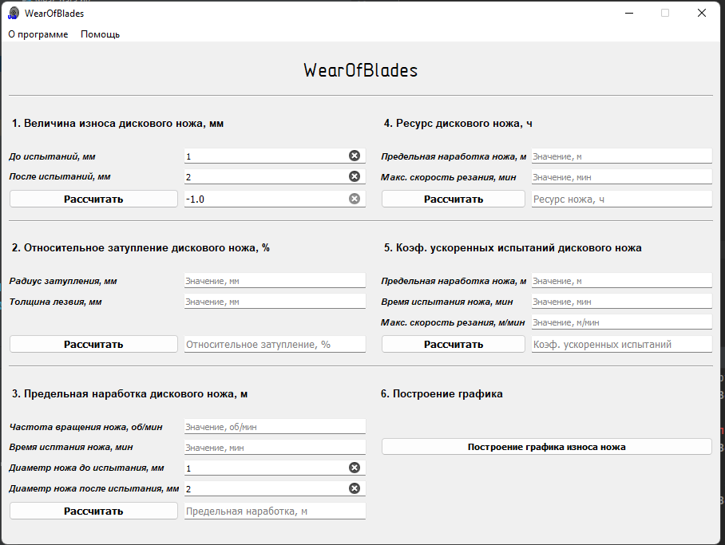

# WearOfBlades

--- 

### Тех. характеристики:

* Python 3.10
* PyQT5

### Запуск

1. Уставноить виртуальное оркужение `venv`
2. Установить зависимости:

```shell
python -m pip install -r requirements.txt
```

3. Запуск:

```shell
python app.py
```

4. Для создания `.exe` файла необходимо запустить `to_exe.bat` (для Windows).

### Скриншоты




